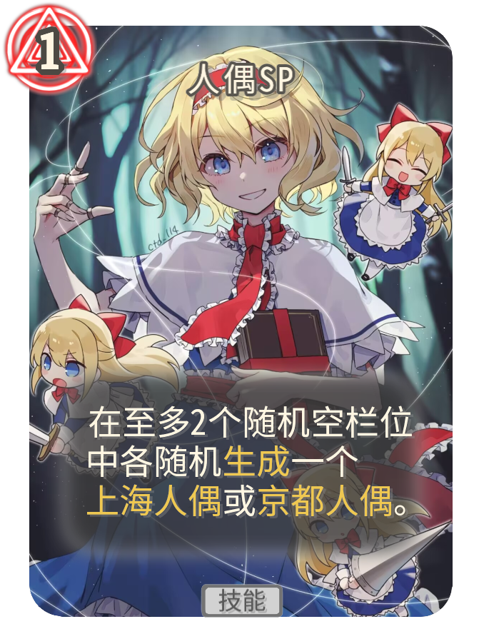

# Signature Example Mod

这是一个用于展示 [STS Signature Mod](https://github.com/antileaf/SignatureLib) 效果的示例模组。

展示的卡牌包含爱丽丝·玛格特罗伊德和小涂真纪两位开发中的角色的卡牌。

前者的卡牌背景采用了扁平化设计，形状是规整的；后者的卡牌背景与原版卡牌相同，形状不完全规整。

请注意，所有卡牌仅供展示，没有效果。

（请善用 Mods 设置中的调试功能，以自动解锁所有异画。）

 

 
